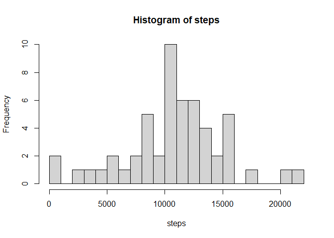
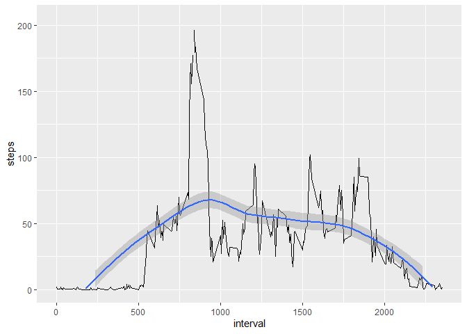
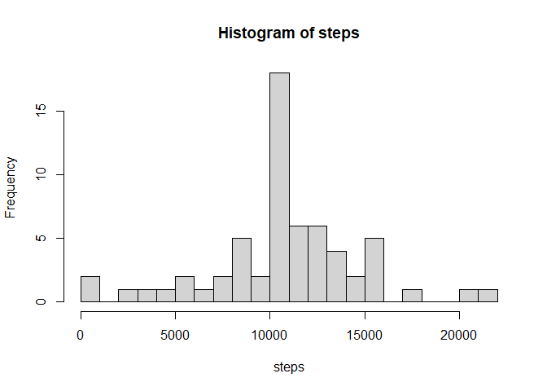
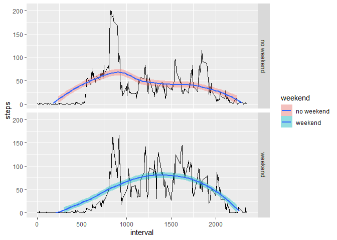

## Loading and preprocessing the data


```r
data <- read.csv(unz("activity.zip", "activity.csv"))
data$date <- as.Date(data$date, format = "%Y-%m-%d")
str(data)
```

```
## 'data.frame':	17568 obs. of  3 variables:
##  $ steps   : int  NA NA NA NA NA NA NA NA NA NA ...
##  $ date    : Date, format: "2012-10-01" "2012-10-01" ...
##  $ interval: int  0 5 10 15 20 25 30 35 40 45 ...
```

```r
summary(data)
```

```
##      steps             date               interval     
##  Min.   :  0.00   Min.   :2012-10-01   Min.   :   0.0  
##  1st Qu.:  0.00   1st Qu.:2012-10-16   1st Qu.: 588.8  
##  Median :  0.00   Median :2012-10-31   Median :1177.5  
##  Mean   : 37.38   Mean   :2012-10-31   Mean   :1177.5  
##  3rd Qu.: 12.00   3rd Qu.:2012-11-15   3rd Qu.:1766.2  
##  Max.   :806.00   Max.   :2012-11-30   Max.   :2355.0  
##  NA's   :2304
```
## What is mean total number of steps taken per day?


```r
library(dplyr)
library(lubridate) #library for dealing with data
library(ggplot2)
data.day <- data %>% group_by(date) %>% summarize(steps = sum(steps))
steps.mean = mean(data.day$steps,na.rm =TRUE)
steps.median = median(data.day$steps,na.rm =TRUE)
```

The steps mean is 1.0766189\times 10^{4} and the median is 10765. Here we can see its histogram:


```r
hist(data.day$steps[!is.nan(data.day$steps)], xlab = "steps", main = "Histogram of steps", breaks = 30)
```

<!-- -->

## What is the average daily activity pattern?

```r
data.interval <- data %>% group_by(interval) %>% summarize(steps = mean(steps, na.rm = TRUE)) 
ggplot(data=data.interval, aes(x=interval, y=steps, na.rm=TRUE))+
  geom_line()+
  geom_smooth()+
  ylim(c(0,205))
```

```
## Warning: Removed 1 rows containing non-finite values (stat_smooth).
```

```
## Warning: Removed 8 rows containing missing values (geom_smooth).
```

<!-- -->

## Imputing missing values


```r
total.na <- sum(is.na(data))
percent.na <- mean(is.na(data))
```

There are 2304 NA's in the dataset, which represent the 0.0437158 %.

With the following for loop these missing values are imputed by the mean of the interval.

```r
data.filled <- data
for (i in 1:dim(data.filled)[1])
  {
  if (is.na(data.filled$steps[i])== TRUE)
    {
    data.filled$steps[i] <- round( mean(data[data$interval == data.filled[i, "interval"], "steps" ], na.rm = TRUE) )
    }
  
}
```

```r
data.day <- data.filled %>% group_by(date) %>% summarize(steps = sum(steps))
steps.mean = mean(data.day$steps,na.rm =TRUE)
steps.median = median(data.day$steps,na.rm =TRUE)
```

The steps mean is 1.0765639\times 10^{4} and the median is 1.0762\times 10^{4}. Here we can see its histogram:


```r
hist(data.day$steps[!is.nan(data.day$steps)], xlab = "steps", main = "Histogram of steps", breaks = 30)
```

<!-- -->


## Are there differences in activity patterns between weekdays and weekends?

```r
data.filled$weekend <- ifelse(weekdays(data.filled$date, abbreviate = TRUE) %in% c("sá.", "do."), "weekend", "no weekend")
data.filled$weekend <- as.factor(data.filled$weekend)

data.interval <- data.filled %>% group_by(interval, weekend) %>% summarize(steps = mean(steps, na.rm = TRUE)) 
ggplot(data=data.interval, aes(x=interval, y=steps, fill = weekend))+
  facet_grid(weekend~.)+
  geom_line()+
  geom_smooth()+
  ylim(c(0,205))
```

```
## Warning: Removed 2 rows containing non-finite values (stat_smooth).
```

```
## Warning: Removed 18 rows containing missing values (geom_smooth).
```

<!-- -->

